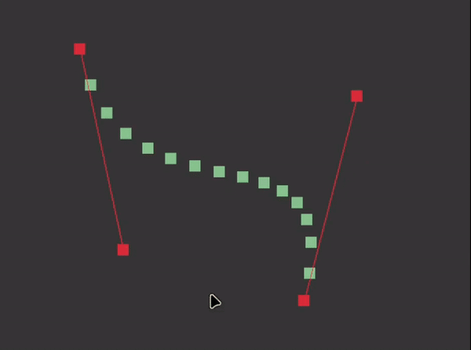

# Bézier Curves

Just a fun little project to learn how to use SDL2 and how to render
Bézier curves.



## Quick Start

```console
make
./bezier
```

## References
- Tsoding's [Coding Bézier Curves — Day 1](https://youtu.be/2oKzBq43ShE)
